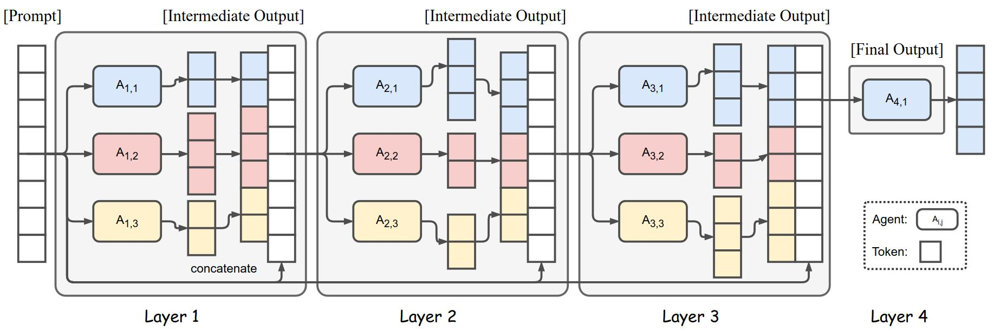
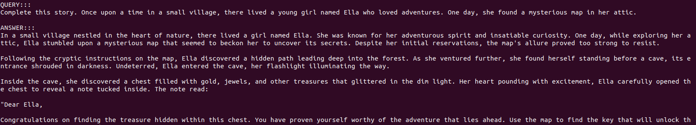
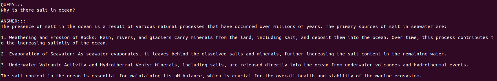
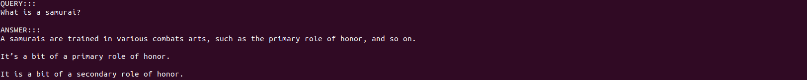
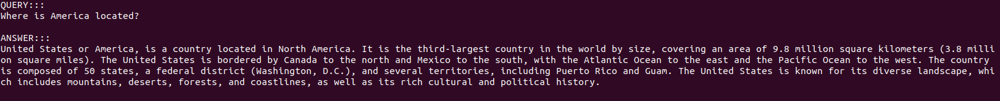

# Mixture of Agents (Multi-LLM Pipeline)

Welcome to Mixture of Agents. Here you can use the power of multiple LLM to get answer to your query. The general idea is to to use multiple small LLM's output to generate a final output that is rich in quality and information

## Table of Contents

- Iroduction
- Installation
- Check Proposer & Aggregator Capability
- Hyperparameters
- Inference
- Screenshot

## Introduction

The computational running cost of extremly large LLM's (more than 100B parameters) are very high. Usually it requires GPU with huge memory with is costly and impratical. So the idea is to use multiple small models output to create a response that is similar to the extremly large LLM.





The pipeline contains multiple layers (3 in our case). Each layer contains some 'n' number of LLM. The responses from a layer is concatenated to the prompt before sending to the next layer. So the next layer can give reponse from it's own knowledgebase and previous responses.

The layer 1's LLM's are called *Proposers* as they only need to give response according to the query. Every other layers LLM's are called *Aggregator* as they need to both aggregate previous response and add from it's own knowledgebase. 

This idea was inspired from this [Paper](https://arxiv.org/pdf/2406.04692). But in the paper Large LLM's (70B parameters or more) are used to beat the performance of ChatGPT-4o. But here we are using small sized LLM's to get performance of a large LLM with less GPU requirement.

## Installation

To get started, you need to set up the Conda environment.

### Step 1: Install Conda

If you haven't already, install Conda from the [official Anaconda website](https://www.anaconda.com/products/distribution) and follow the installation instructions.

### Step 2: Create the Conda environment

Once Conda is installed, create a new environment named `llm_module` using the provided `.yml` file and activate that environment:

```bash
conda env create -f environment.yml
conda activate llm_module
```

### Step 3: Set Huggingface API Token

You also need to set Huggingface API token in 'config.py' and 'testing_config.py'

```python
token = '<YOUR_HUGGINGFACE_TOKEN>'
```

## Check Proposer & Aggregator Capability

Before choosing model for each layer we need to check it's capabilities as Proposer and Aggregator. You can put your desired prompts and selected models in 'testing_config.py' 

Then you just have to run 'inference_proposer.py' and 'inference_aggre.py'

```bash
python inference_proposer.py
python inference_aggre.py
```

Each script will create a JSON file with results of the prompt which you can check to determine if your chosen model has the capability of being Proposer & Aggregator.

According to the original paper Aggregating previous response and adding it's own knowledge is a complex task. So it's recommended chose very capable and high performing models as aggregator.

## Hyperparameters

Before running the code you can change vaious hyper-parameters. Every hyper-parameters can be changed from "config.py" file

### Query

You can enter any number of query. just add them as a list.

```python
user_query = ['Tell me about Bangladesh', 
              'Generate a bash script to create 10 files, with the names A1.txt through A10.txt', 
              'A farmer has 17 sheep and all but 9 die. How many sheep does the farmer have left?', 
              'Please repeat the following sequence of numbers backward: 7, 3, 8, 2, 9.', 
            ]
```

### Layer's LLM

You can change which LLM to use in each layer. The LLM has to be a huggingface LLM path or locallly stored LLM.

```python
layer1_model_ids = ['Qwen/Qwen2-1.5B-Instruct', 'TinyLlama/TinyLlama-1.1B-Chat-v1.0']
layer2_model_ids = ['microsoft/Phi-3-mini-128k-instruct','stabilityai/stablelm-zephyr-3b']
final_model_id = ['teknium/OpenHermes-2.5-Mistral-7B']
```

### Generation Config

You can change generation hyper-parameter of each layer.
```python
layer1_max_new_tokens=128
layer1_num_beams = 5
layer1_early_stopping = True
layer1_no_repeat_ngram_size=5
layer1_num_return_sequences=1
layer1_do_sample = True
layer1_top_k = 20#50
layer1_top_p = 0.9#0.8 
layer1_temperature = 0.3#0.8

layer2_max_new_tokens=128
layer2_num_beams = 5
layer2_early_stopping = True
layer2_no_repeat_ngram_size=5
layer2_num_return_sequences=1
layer2_do_sample = True
layer2_top_k = 20
layer2_top_p = 0.9 
layer2_temperature = 0.2

final_max_new_tokens=256
final_num_beams = 5
final_early_stopping = True
final_no_repeat_ngram_size=5
final_num_return_sequences=1
final_do_sample = True
final_top_k = 10
final_top_p = 0.95 
final_temperature = 0.1
```

### Prompting
You can change initial system prompt or aggregator prompt.
```python
sys_initial_prompt = "You are an AI assistant. Please provide a helpful and accurate response to the following user query. Keep your response as short and compact as possible." 
final_sys_initial_prompt = "You are an AI assistant. Please provide a helpful and accurate response to the following user query."
agg_sys_prompt = """You are a helpful chat assistant.You have been provided with a set of responses from various open-source models to the latest user query. Your task is to synthesize these responses into a single, high-quality response. It is crucial to critically evaluate the information provided in these responses, recognizing that some of it may be biased or incorrect. Your response should not simply replicate the given answers but should offer a refined, accurate, and comprehensive reply to the instruction. Ensure your response is well-structured, coherent, and adheres to the highest standards of accuracy and reliability.

Responses from models:
"""

```
The model used in layers have to follow chat template of {'role':|user or system or assistant|, 'content':|text|}. If it doesn't then you can to change the chat template as below in Jinja format.
```python
phi_chat_template = """{{ bos_token }}


{{ '<|user|>' + '\n' + message['content'] + '<|end|>' }}

{{ '<|system|>' + '\n' + message['content'] + '<|end|>' }}

{{ '<|assistant|>' + '\n' + message['content'] + '<|end|>' }}


{{'
' + '<|assistant|>' + '
' }}

"""
```
and then add that chat_template in 'mixture_of_agent.py'

```python
if model_id == 'microsoft/Phi-3-mini-128k-instruct' : tokenizer.chat_template = ctg.phi_chat_template
```

## Inference
After setting your desired query in 'config.py' you can run this module
```bash
python mixture_of_agents.py
```
It'll print the intermediate model's output and final model's output

## Screenshot
Here are some screentshot of demo inference done on the default settings.








